# CEO 전략 분석 도구 - 데이터베이스 스키마

> Cursor AI 개발용 완전한 DB 스키마

---

## 1. 데이터베이스 구성

```
┌─────────────────────────────────────────────┐
│              PostgreSQL (Main)              │
│                                             │
│  - 모든 비즈니스 데이터                      │
│  - 트랜잭션 처리                            │
│  - 관계형 쿼리                              │
└─────────────────────────────────────────────┘
                    │
                    ▼
┌─────────────────────────────────────────────┐
│              Neo4j (Graph) - Optional       │
│                                             │
│  - 이해관계자 관계망                         │
│  - 영향력 분석                              │
│  - 복잡한 관계 쿼리                         │
└─────────────────────────────────────────────┘
                    │
                    ▼
┌─────────────────────────────────────────────┐
│              Redis (Cache)                  │
│                                             │
│  - API 응답 캐시                            │
│  - 세션 관리                                │
│  - 백그라운드 작업 큐                        │
└─────────────────────────────────────────────┘
```

---

## 2. PostgreSQL 스키마

### 2.1 공통 테이블

```sql
-- =============================================
-- 공통: 사용자 및 설정
-- =============================================

CREATE TABLE users (
    id UUID PRIMARY KEY DEFAULT gen_random_uuid(),
    email VARCHAR(255) UNIQUE NOT NULL,
    name VARCHAR(255) NOT NULL,
    role VARCHAR(50) DEFAULT 'user',  -- 'admin', 'user', 'viewer'
    created_at TIMESTAMP DEFAULT NOW(),
    updated_at TIMESTAMP DEFAULT NOW()
);

CREATE TABLE settings (
    id UUID PRIMARY KEY DEFAULT gen_random_uuid(),
    user_id UUID REFERENCES users(id) ON DELETE CASCADE,
    key VARCHAR(255) NOT NULL,
    value JSONB NOT NULL,
    created_at TIMESTAMP DEFAULT NOW(),
    updated_at TIMESTAMP DEFAULT NOW(),
    UNIQUE(user_id, key)
);

-- 변경 이력 추적용 공통 함수
CREATE OR REPLACE FUNCTION update_updated_at()
RETURNS TRIGGER AS $$
BEGIN
    NEW.updated_at = NOW();
    RETURN NEW;
END;
$$ LANGUAGE plpgsql;
```

### 2.2 산업 구조 (Industry Structure)

```sql
-- =============================================
-- 산업 구조 분석
-- =============================================

CREATE TABLE industry_profiles (
    id UUID PRIMARY KEY DEFAULT gen_random_uuid(),
    name VARCHAR(255) NOT NULL,              -- "터널/도로 안전 산업"
    description TEXT,

    -- Porter's 5 Forces (1-5 점수)
    supplier_power INTEGER CHECK (supplier_power BETWEEN 1 AND 5),
    buyer_power INTEGER CHECK (buyer_power BETWEEN 1 AND 5),
    competitive_rivalry INTEGER CHECK (competitive_rivalry BETWEEN 1 AND 5),
    threat_of_substitution INTEGER CHECK (threat_of_substitution BETWEEN 1 AND 5),
    threat_of_new_entry INTEGER CHECK (threat_of_new_entry BETWEEN 1 AND 5),

    -- 메타데이터
    analysis_date DATE DEFAULT CURRENT_DATE,
    analyst_notes TEXT,

    created_at TIMESTAMP DEFAULT NOW(),
    updated_at TIMESTAMP DEFAULT NOW()
);

CREATE TRIGGER industry_profiles_updated_at
    BEFORE UPDATE ON industry_profiles
    FOR EACH ROW EXECUTE FUNCTION update_updated_at();

-- 5 Forces 평가 상세
CREATE TABLE five_forces_details (
    id UUID PRIMARY KEY DEFAULT gen_random_uuid(),
    industry_id UUID REFERENCES industry_profiles(id) ON DELETE CASCADE,
    force_type VARCHAR(50) NOT NULL,  -- 'supplier', 'buyer', 'rivalry', 'substitution', 'entry'

    -- 평가 요소별 점수
    factors JSONB NOT NULL,  -- {"factor_name": score, ...}
    /*
    예시 (supplier_power):
    {
        "num_suppliers": 2,
        "switching_cost": 0.7,
        "supplier_concentration": 0.8,
        "input_importance": 0.9
    }
    */

    calculated_score INTEGER,
    rationale TEXT,

    created_at TIMESTAMP DEFAULT NOW()
);

-- 돈의 흐름 (Sankey 다이어그램용)
CREATE TABLE money_flows (
    id UUID PRIMARY KEY DEFAULT gen_random_uuid(),
    industry_id UUID REFERENCES industry_profiles(id) ON DELETE CASCADE,

    source_entity VARCHAR(255) NOT NULL,    -- "정부 예산"
    source_type VARCHAR(50),                -- 'government', 'company', 'fund'
    target_entity VARCHAR(255) NOT NULL,    -- "한국도로공사"
    target_type VARCHAR(50),

    flow_type VARCHAR(50) NOT NULL,         -- 'budget', 'contract', 'subsidy', 'investment'
    amount BIGINT,                          -- 금액 (원)
    amount_unit VARCHAR(20) DEFAULT '원',
    amount_description VARCHAR(255),        -- "연간 약 500억원"

    fiscal_year INTEGER,
    notes TEXT,
    source_url TEXT,

    created_at TIMESTAMP DEFAULT NOW(),
    updated_at TIMESTAMP DEFAULT NOW()
);

-- 발주/책임 구조
CREATE TABLE industry_structures (
    id UUID PRIMARY KEY DEFAULT gen_random_uuid(),
    industry_id UUID REFERENCES industry_profiles(id) ON DELETE CASCADE,

    structure_type VARCHAR(50) NOT NULL,    -- 'procurement', 'responsibility', 'decision'

    -- 구조 데이터 (JSON으로 유연하게)
    nodes JSONB NOT NULL,
    /*
    [
        {"id": "1", "name": "국토부", "type": "government", "level": 1},
        {"id": "2", "name": "한국도로공사", "type": "agency", "level": 2}
    ]
    */

    edges JSONB NOT NULL,
    /*
    [
        {"from": "1", "to": "2", "label": "예산 배정", "type": "budget"}
    ]
    */

    description TEXT,

    created_at TIMESTAMP DEFAULT NOW(),
    updated_at TIMESTAMP DEFAULT NOW()
);
```

### 2.3 시장 규모 (Market Size)

```sql
-- =============================================
-- 시장 규모 분석
-- =============================================

CREATE TABLE market_analyses (
    id UUID PRIMARY KEY DEFAULT gen_random_uuid(),
    name VARCHAR(255) NOT NULL,              -- "터널 안전 시장 2024"
    description TEXT,
    base_year INTEGER NOT NULL,              -- 기준 연도

    -- TAM (Total Addressable Market)
    tam_value DECIMAL(20, 2),
    tam_unit VARCHAR(20) DEFAULT '억원',
    tam_calculation_method VARCHAR(50),      -- 'top_down', 'bottom_up'
    tam_assumptions JSONB,                   -- 계산 가정들
    tam_sources TEXT[],                      -- 출처 목록

    -- SAM (Serviceable Addressable Market)
    sam_value DECIMAL(20, 2),
    sam_unit VARCHAR(20) DEFAULT '억원',
    sam_calculation_method VARCHAR(50),
    sam_assumptions JSONB,
    sam_sources TEXT[],

    -- SOM (Serviceable Obtainable Market)
    som_value DECIMAL(20, 2),
    som_unit VARCHAR(20) DEFAULT '억원',
    som_calculation_method VARCHAR(50),
    som_assumptions JSONB,
    som_target_year INTEGER,                 -- 목표 달성 연도

    -- 성장률
    cagr_percent DECIMAL(5, 2),              -- 연평균 성장률
    growth_rationale TEXT,                   -- "왜 커지는가"

    -- 상태
    status VARCHAR(50) DEFAULT 'draft',      -- 'draft', 'reviewed', 'approved'

    created_at TIMESTAMP DEFAULT NOW(),
    updated_at TIMESTAMP DEFAULT NOW()
);

CREATE TRIGGER market_analyses_updated_at
    BEFORE UPDATE ON market_analyses
    FOR EACH ROW EXECUTE FUNCTION update_updated_at();

-- 시장 규모 근거 자료
CREATE TABLE market_evidences (
    id UUID PRIMARY KEY DEFAULT gen_random_uuid(),
    market_id UUID REFERENCES market_analyses(id) ON DELETE CASCADE,

    evidence_type VARCHAR(50) NOT NULL,
    /*
    'accident_stat'     - 사고 통계
    'policy_budget'     - 정책 예산
    'infra_plan'        - 인프라 계획
    'overseas_demand'   - 해외 수요
    'research_report'   - 리서치 리포트
    'government_data'   - 정부 통계
    */

    title VARCHAR(500) NOT NULL,
    description TEXT,

    -- 데이터
    data_value VARCHAR(255),                 -- "연간 사고 1,200건"
    data_year INTEGER,
    data_source VARCHAR(255),                -- "도로교통공단"
    source_url TEXT,

    -- 신뢰도
    reliability VARCHAR(20) DEFAULT 'medium', -- 'high', 'medium', 'low'

    -- 첨부
    attachment_path TEXT,

    created_at TIMESTAMP DEFAULT NOW()
);

-- 시장 규모 예측 (연도별)
CREATE TABLE market_projections (
    id UUID PRIMARY KEY DEFAULT gen_random_uuid(),
    market_id UUID REFERENCES market_analyses(id) ON DELETE CASCADE,

    year INTEGER NOT NULL,

    tam_projected DECIMAL(20, 2),
    sam_projected DECIMAL(20, 2),
    som_projected DECIMAL(20, 2),

    growth_rate DECIMAL(5, 2),               -- 해당 연도 성장률
    assumptions TEXT,

    UNIQUE(market_id, year)
);
```

### 2.4 정책 트래킹 (Policy Tracking)

```sql
-- =============================================
-- 정책/제도 트래킹
-- =============================================

-- 모니터링 키워드
CREATE TABLE policy_keywords (
    id UUID PRIMARY KEY DEFAULT gen_random_uuid(),
    keyword VARCHAR(255) NOT NULL UNIQUE,
    category VARCHAR(50),                    -- 'direct', 'infrastructure', 'safety', 'technology'
    weight DECIMAL(3, 2) DEFAULT 1.0,        -- 키워드 가중치
    is_active BOOLEAN DEFAULT TRUE,
    created_at TIMESTAMP DEFAULT NOW()
);

-- 정책 문서
CREATE TABLE policy_items (
    id UUID PRIMARY KEY DEFAULT gen_random_uuid(),

    -- 기본 정보
    title VARCHAR(1000) NOT NULL,
    source_org VARCHAR(255) NOT NULL,        -- "국토교통부"
    source_type VARCHAR(50),                 -- 'ministry', 'agency', 'local_gov'
    policy_type VARCHAR(50),                 -- 'law', 'plan', 'budget', 'press_release'

    -- 원본 링크
    source_url TEXT,
    published_at TIMESTAMP,

    -- 본문
    content_raw TEXT,                        -- 원본 텍스트
    content_length INTEGER,

    -- AI 분석 결과
    summary TEXT,                            -- AI 생성 요약
    key_points JSONB,                        -- ["핵심 포인트1", "핵심 포인트2"]

    -- 연관성 분석
    relevance_score DECIMAL(5, 2),           -- 계산된 연관성 점수
    relevance_grade INTEGER CHECK (relevance_grade BETWEEN 1 AND 5),
    relevance_reason TEXT,

    -- AI 분석 상세
    ai_analysis JSONB,
    /*
    {
        "opportunities": ["기회1", "기회2"],
        "risks": ["위험1"],
        "actions": ["액션1"],
        "related_products": ["Lux-Guard"]
    }
    */

    -- 사용자 분류
    is_bookmarked BOOLEAN DEFAULT FALSE,
    is_read BOOLEAN DEFAULT FALSE,
    user_notes TEXT,
    tags TEXT[],

    -- 메타
    crawled_at TIMESTAMP DEFAULT NOW(),
    analyzed_at TIMESTAMP,

    created_at TIMESTAMP DEFAULT NOW(),
    updated_at TIMESTAMP DEFAULT NOW()
);

CREATE INDEX idx_policy_items_published ON policy_items(published_at DESC);
CREATE INDEX idx_policy_items_relevance ON policy_items(relevance_grade DESC);
CREATE INDEX idx_policy_items_source ON policy_items(source_org);

-- 정책-키워드 매칭
CREATE TABLE policy_keyword_matches (
    policy_id UUID REFERENCES policy_items(id) ON DELETE CASCADE,
    keyword_id UUID REFERENCES policy_keywords(id) ON DELETE CASCADE,
    match_count INTEGER DEFAULT 1,
    PRIMARY KEY (policy_id, keyword_id)
);

-- 정책 알림 이력
CREATE TABLE policy_notifications (
    id UUID PRIMARY KEY DEFAULT gen_random_uuid(),
    policy_id UUID REFERENCES policy_items(id) ON DELETE CASCADE,

    notification_type VARCHAR(50),           -- 'email', 'slack', 'push'
    recipient VARCHAR(255),
    sent_at TIMESTAMP,
    status VARCHAR(50) DEFAULT 'pending'     -- 'pending', 'sent', 'failed'
);

-- 정책 소스 (크롤링 대상)
CREATE TABLE policy_sources (
    id UUID PRIMARY KEY DEFAULT gen_random_uuid(),
    name VARCHAR(255) NOT NULL,              -- "국토부 보도자료"
    org_name VARCHAR(255),                   -- "국토교통부"

    source_type VARCHAR(50),                 -- 'rss', 'webpage', 'api'
    url TEXT NOT NULL,

    -- 크롤링 설정
    crawl_frequency_minutes INTEGER DEFAULT 60,
    last_crawled_at TIMESTAMP,
    crawl_config JSONB,                      -- 크롤링 설정 (selector 등)

    is_active BOOLEAN DEFAULT TRUE,

    created_at TIMESTAMP DEFAULT NOW()
);
```

### 2.5 기술 트렌드 (Tech Radar)

```sql
-- =============================================
-- 기술 트렌드 Radar
-- =============================================

CREATE TABLE tech_items (
    id UUID PRIMARY KEY DEFAULT gen_random_uuid(),

    name VARCHAR(255) NOT NULL,
    description TEXT,

    -- Radar 위치
    quadrant VARCHAR(50) NOT NULL,
    /*
    'techniques'    - 기법/방법론
    'tools'         - 도구
    'platforms'     - 플랫폼
    'languages'     - 언어/프레임워크
    */

    ring VARCHAR(50) NOT NULL,
    /*
    'adopt'     - 적극 도입
    'trial'     - 시범 적용
    'assess'    - 평가 중
    'hold'      - 보류
    */

    -- 평가 요소
    maturity_score DECIMAL(3, 2),            -- 0-1
    adoption_rate DECIMAL(3, 2),             -- 0-1
    our_experience DECIMAL(3, 2),            -- 0-1
    strategic_fit DECIMAL(3, 2),             -- 0-1
    risk_level DECIMAL(3, 2),                -- 0-1

    -- 분류 결과
    calculated_ring VARCHAR(50),             -- 알고리즘 계산 결과
    ring_override BOOLEAN DEFAULT FALSE,     -- 수동 변경 여부
    ring_override_reason TEXT,

    -- 대체 가능성
    is_replaceable BOOLEAN,
    replaceability_score DECIMAL(3, 2),
    replaceability_analysis TEXT,

    -- 우리 기술과의 관계
    our_usage TEXT,                          -- 우리가 어떻게 사용하는지
    our_position TEXT,                       -- 우리 기술과의 관계

    -- 메타
    is_new BOOLEAN DEFAULT TRUE,             -- 이번 분기 신규

    created_at TIMESTAMP DEFAULT NOW(),
    updated_at TIMESTAMP DEFAULT NOW()
);

CREATE TRIGGER tech_items_updated_at
    BEFORE UPDATE ON tech_items
    FOR EACH ROW EXECUTE FUNCTION update_updated_at();

-- 기술 변경 이력
CREATE TABLE tech_history (
    id UUID PRIMARY KEY DEFAULT gen_random_uuid(),
    tech_id UUID REFERENCES tech_items(id) ON DELETE CASCADE,

    previous_ring VARCHAR(50),
    new_ring VARCHAR(50),
    change_reason TEXT,

    changed_by UUID REFERENCES users(id),
    changed_at TIMESTAMP DEFAULT NOW()
);

-- 기술 관련 뉴스/리소스
CREATE TABLE tech_resources (
    id UUID PRIMARY KEY DEFAULT gen_random_uuid(),
    tech_id UUID REFERENCES tech_items(id) ON DELETE CASCADE,

    resource_type VARCHAR(50),               -- 'news', 'paper', 'blog', 'video'
    title VARCHAR(500),
    url TEXT,
    summary TEXT,

    published_at DATE,
    added_at TIMESTAMP DEFAULT NOW()
);
```

### 2.6 경쟁사 분석 (Competitor Analysis)

```sql
-- =============================================
-- 경쟁사 분석
-- =============================================

CREATE TABLE competitors (
    id UUID PRIMARY KEY DEFAULT gen_random_uuid(),

    name VARCHAR(255) NOT NULL,
    name_en VARCHAR(255),
    country VARCHAR(100),
    website TEXT,
    logo_url TEXT,

    -- 분류
    competitor_type VARCHAR(50) NOT NULL,
    /*
    'direct'        - 직접 경쟁
    'indirect'      - 간접 경쟁
    'potential'     - 잠재 경쟁
    'substitute'    - 대체재
    */

    -- 설명
    description TEXT,
    approach_difference TEXT,                -- 우리와 다른 접근 방식

    -- 포지셔닝 (0-1 스케일)
    position_price DECIMAL(3, 2),            -- 가격 (높을수록 고가)
    position_technology DECIMAL(3, 2),       -- 기술 수준
    position_quality DECIMAL(3, 2),          -- 품질
    position_coverage DECIMAL(3, 2),         -- 시장 커버리지
    position_innovation DECIMAL(3, 2),       -- 혁신성
    position_service DECIMAL(3, 2),          -- 서비스 수준

    -- SWOT
    strengths TEXT[],
    weaknesses TEXT[],
    opportunities TEXT[],
    threats TEXT[],

    -- 메타
    last_updated DATE,
    data_confidence VARCHAR(20) DEFAULT 'medium',  -- 'high', 'medium', 'low'

    created_at TIMESTAMP DEFAULT NOW(),
    updated_at TIMESTAMP DEFAULT NOW()
);

CREATE TRIGGER competitors_updated_at
    BEFORE UPDATE ON competitors
    FOR EACH ROW EXECUTE FUNCTION update_updated_at();

-- 기능 정의 (비교 매트릭스용)
CREATE TABLE feature_definitions (
    id UUID PRIMARY KEY DEFAULT gen_random_uuid(),

    name VARCHAR(255) NOT NULL UNIQUE,
    category VARCHAR(100),                   -- 기능 카테고리
    description TEXT,

    weight DECIMAL(3, 2) DEFAULT 1.0,        -- 중요도 가중치
    is_differentiator BOOLEAN DEFAULT FALSE, -- 핵심 차별화 요소

    display_order INTEGER DEFAULT 0,

    created_at TIMESTAMP DEFAULT NOW()
);

-- 우리 기능 점수
CREATE TABLE our_features (
    id UUID PRIMARY KEY DEFAULT gen_random_uuid(),
    feature_id UUID REFERENCES feature_definitions(id) ON DELETE CASCADE,

    score INTEGER CHECK (score BETWEEN 0 AND 2),  -- 0: 없음, 1: 부분, 2: 완전
    notes TEXT,

    updated_at TIMESTAMP DEFAULT NOW(),
    UNIQUE(feature_id)
);

-- 경쟁사 기능 점수
CREATE TABLE competitor_features (
    id UUID PRIMARY KEY DEFAULT gen_random_uuid(),
    competitor_id UUID REFERENCES competitors(id) ON DELETE CASCADE,
    feature_id UUID REFERENCES feature_definitions(id) ON DELETE CASCADE,

    score INTEGER CHECK (score BETWEEN 0 AND 2),
    notes TEXT,
    source TEXT,                             -- 정보 출처

    updated_at TIMESTAMP DEFAULT NOW(),
    UNIQUE(competitor_id, feature_id)
);

-- 경쟁사 뉴스/동향
CREATE TABLE competitor_news (
    id UUID PRIMARY KEY DEFAULT gen_random_uuid(),
    competitor_id UUID REFERENCES competitors(id) ON DELETE CASCADE,

    title VARCHAR(1000) NOT NULL,
    summary TEXT,
    url TEXT,
    source VARCHAR(255),

    news_type VARCHAR(50),                   -- 'funding', 'product', 'partnership', 'hiring', 'general'
    sentiment VARCHAR(20),                   -- 'positive', 'neutral', 'negative'

    published_at TIMESTAMP,
    crawled_at TIMESTAMP DEFAULT NOW()
);

CREATE INDEX idx_competitor_news_date ON competitor_news(published_at DESC);
```

### 2.7 이해관계자 (Stakeholder)

```sql
-- =============================================
-- 이해관계자 분석
-- =============================================

CREATE TABLE organizations (
    id UUID PRIMARY KEY DEFAULT gen_random_uuid(),

    name VARCHAR(255) NOT NULL,
    name_en VARCHAR(255),

    org_type VARCHAR(50) NOT NULL,
    /*
    'government'    - 정부 기관
    'agency'        - 공공 기관
    'company'       - 기업
    'association'   - 협회
    'research'      - 연구 기관
    */

    description TEXT,
    website TEXT,

    -- 계층 구조
    parent_org_id UUID REFERENCES organizations(id),

    created_at TIMESTAMP DEFAULT NOW()
);

CREATE TABLE stakeholders (
    id UUID PRIMARY KEY DEFAULT gen_random_uuid(),

    name VARCHAR(255) NOT NULL,
    title VARCHAR(255),                      -- 직함
    organization_id UUID REFERENCES organizations(id),
    department VARCHAR(255),

    stakeholder_type VARCHAR(50),            -- 'individual', 'role'

    -- Power-Interest Grid
    power_level INTEGER CHECK (power_level BETWEEN 1 AND 5),
    interest_level INTEGER CHECK (interest_level BETWEEN 1 AND 5),
    influence_level INTEGER CHECK (influence_level BETWEEN 1 AND 5),

    -- 보유 권한
    has_budget BOOLEAN DEFAULT FALSE,
    has_decision_power BOOLEAN DEFAULT FALSE,
    has_data_access BOOLEAN DEFAULT FALSE,
    has_technical_authority BOOLEAN DEFAULT FALSE,

    -- 분류 결과
    strategy VARCHAR(50),                    -- 'manage_closely', 'keep_satisfied', 'keep_informed', 'monitor'
    priority INTEGER,

    -- 관계
    relationship_status VARCHAR(50),         -- 'strong', 'moderate', 'weak', 'none'
    last_contact_date DATE,

    -- 메모
    notes TEXT,
    contact_info JSONB,                      -- {"email": "", "phone": "", "linkedin": ""}

    created_at TIMESTAMP DEFAULT NOW(),
    updated_at TIMESTAMP DEFAULT NOW()
);

CREATE TRIGGER stakeholders_updated_at
    BEFORE UPDATE ON stakeholders
    FOR EACH ROW EXECUTE FUNCTION update_updated_at();

-- 이해관계자 간 관계
CREATE TABLE stakeholder_relations (
    id UUID PRIMARY KEY DEFAULT gen_random_uuid(),

    from_stakeholder_id UUID REFERENCES stakeholders(id) ON DELETE CASCADE,
    to_stakeholder_id UUID REFERENCES stakeholders(id) ON DELETE CASCADE,

    relation_type VARCHAR(50) NOT NULL,
    /*
    'reports_to'    - 보고 관계
    'influences'    - 영향력 관계
    'collaborates'  - 협력 관계
    'competes'      - 경쟁 관계
    'funds'         - 자금 지원
    'contracts'     - 계약 관계
    */

    strength DECIMAL(3, 2) DEFAULT 0.5,      -- 관계 강도 (0-1)
    description TEXT,

    created_at TIMESTAMP DEFAULT NOW(),

    UNIQUE(from_stakeholder_id, to_stakeholder_id, relation_type)
);

-- 조직 간 관계
CREATE TABLE organization_relations (
    id UUID PRIMARY KEY DEFAULT gen_random_uuid(),

    from_org_id UUID REFERENCES organizations(id) ON DELETE CASCADE,
    to_org_id UUID REFERENCES organizations(id) ON DELETE CASCADE,

    relation_type VARCHAR(50) NOT NULL,      -- 'supervises', 'funds', 'contracts', 'partners'

    description TEXT,

    created_at TIMESTAMP DEFAULT NOW(),

    UNIQUE(from_org_id, to_org_id, relation_type)
);

-- 이해관계자 활동 로그
CREATE TABLE stakeholder_activities (
    id UUID PRIMARY KEY DEFAULT gen_random_uuid(),
    stakeholder_id UUID REFERENCES stakeholders(id) ON DELETE CASCADE,

    activity_type VARCHAR(50),               -- 'meeting', 'email', 'call', 'event'
    activity_date DATE NOT NULL,
    description TEXT,
    outcome TEXT,

    next_action TEXT,
    next_action_date DATE,

    created_at TIMESTAMP DEFAULT NOW()
);
```

### 2.8 Timing Thesis

```sql
-- =============================================
-- Timing Thesis (왜 지금인가)
-- =============================================

CREATE TABLE timing_factors (
    id UUID PRIMARY KEY DEFAULT gen_random_uuid(),

    name VARCHAR(255) NOT NULL,              -- "AI 기술 성숙"
    category VARCHAR(50) NOT NULL,
    /*
    'technology'    - 기술적 요인
    'policy'        - 정책/규제
    'market'        - 시장 변화
    'social'        - 사회적 요인
    'economic'      - 경제적 요인
    */

    description TEXT,
    current_state TEXT,                      -- 현재 상황 설명

    -- 트렌드
    trend_direction VARCHAR(50),             -- 'accelerating', 'stable', 'decelerating'
    maturity_level DECIMAL(3, 2),            -- 0-1

    -- 기회 창
    window_start DATE,
    window_peak DATE,
    window_end DATE,

    -- 영향도
    impact_score DECIMAL(3, 2),              -- 0-1
    confidence DECIMAL(3, 2),                -- 0-1 (확신도)

    created_at TIMESTAMP DEFAULT NOW(),
    updated_at TIMESTAMP DEFAULT NOW()
);

CREATE TRIGGER timing_factors_updated_at
    BEFORE UPDATE ON timing_factors
    FOR EACH ROW EXECUTE FUNCTION update_updated_at();

-- Factor 근거 자료
CREATE TABLE timing_evidences (
    id UUID PRIMARY KEY DEFAULT gen_random_uuid(),
    factor_id UUID REFERENCES timing_factors(id) ON DELETE CASCADE,

    title VARCHAR(500) NOT NULL,
    description TEXT,

    data_point VARCHAR(255),                 -- 구체적 수치/사례
    source_url TEXT,
    source_name VARCHAR(255),
    source_date DATE,

    evidence_type VARCHAR(50),               -- 'statistic', 'news', 'report', 'event'

    created_at TIMESTAMP DEFAULT NOW()
);

-- Timing Thesis (버전 관리)
CREATE TABLE timing_theses (
    id UUID PRIMARY KEY DEFAULT gen_random_uuid(),

    version INTEGER DEFAULT 1,
    target_audience VARCHAR(100),            -- 'investor', 'government', 'partner', 'internal'

    -- 핵심 문장
    thesis_statement TEXT NOT NULL,
    one_liner TEXT,                          -- 한 줄 요약

    -- AI 생성 여부
    is_ai_generated BOOLEAN DEFAULT FALSE,
    ai_model VARCHAR(100),

    -- 상태
    status VARCHAR(50) DEFAULT 'draft',      -- 'draft', 'reviewed', 'approved'

    created_at TIMESTAMP DEFAULT NOW(),
    updated_at TIMESTAMP DEFAULT NOW()
);

-- Thesis-Factor 연결
CREATE TABLE thesis_factors (
    thesis_id UUID REFERENCES timing_theses(id) ON DELETE CASCADE,
    factor_id UUID REFERENCES timing_factors(id) ON DELETE CASCADE,

    display_order INTEGER DEFAULT 0,

    PRIMARY KEY (thesis_id, factor_id)
);
```

### 2.9 대시보드 및 내보내기

```sql
-- =============================================
-- 대시보드 / 보고서
-- =============================================

-- 대시보드 스냅샷
CREATE TABLE dashboard_snapshots (
    id UUID PRIMARY KEY DEFAULT gen_random_uuid(),

    snapshot_date DATE NOT NULL,

    -- Health Score
    total_score DECIMAL(5, 2),
    grade VARCHAR(5),

    -- 개별 점수
    market_clarity_score DECIMAL(5, 2),
    competitive_awareness_score DECIMAL(5, 2),
    timing_readiness_score DECIMAL(5, 2),
    policy_tracking_score DECIMAL(5, 2),
    stakeholder_mapping_score DECIMAL(5, 2),

    -- 전체 데이터 스냅샷
    full_data JSONB,

    created_at TIMESTAMP DEFAULT NOW()
);

CREATE INDEX idx_dashboard_snapshots_date ON dashboard_snapshots(snapshot_date DESC);

-- 내보내기 이력
CREATE TABLE export_history (
    id UUID PRIMARY KEY DEFAULT gen_random_uuid(),

    export_type VARCHAR(50) NOT NULL,        -- 'market_onepager', 'timing_thesis', 'competitor_matrix'
    format VARCHAR(20) NOT NULL,             -- 'pdf', 'png', 'xlsx'

    parameters JSONB,                        -- 내보내기 옵션
    file_path TEXT,
    file_size INTEGER,

    exported_by UUID REFERENCES users(id),
    exported_at TIMESTAMP DEFAULT NOW()
);

-- 알림 설정
CREATE TABLE notification_settings (
    id UUID PRIMARY KEY DEFAULT gen_random_uuid(),
    user_id UUID REFERENCES users(id) ON DELETE CASCADE,

    notification_type VARCHAR(50) NOT NULL,  -- 'policy_new', 'competitor_news', 'score_change'
    channel VARCHAR(50) NOT NULL,            -- 'email', 'slack', 'webhook'

    config JSONB,                            -- 채널별 설정
    /*
    email: {"address": "ceo@company.com"}
    slack: {"webhook_url": "...", "channel": "#alerts"}
    */

    is_active BOOLEAN DEFAULT TRUE,

    created_at TIMESTAMP DEFAULT NOW()
);
```

---

## 3. Neo4j 그래프 스키마 (Optional)

> PostgreSQL만으로도 구현 가능하지만, 복잡한 관계 분석이 필요하면 Neo4j 사용

### 3.1 노드 타입

```cypher
// 이해관계자
CREATE CONSTRAINT stakeholder_id IF NOT EXISTS
FOR (s:Stakeholder) REQUIRE s.id IS UNIQUE;

// 노드 속성
(:Stakeholder {
    id: STRING,           // PostgreSQL의 UUID
    name: STRING,
    title: STRING,
    organization: STRING,
    power: INTEGER,       // 1-5
    interest: INTEGER,    // 1-5
    influence: INTEGER,   // 1-5
    has_budget: BOOLEAN,
    has_decision_power: BOOLEAN,
    strategy: STRING      // 'manage_closely', etc.
})

// 조직
CREATE CONSTRAINT organization_id IF NOT EXISTS
FOR (o:Organization) REQUIRE o.id IS UNIQUE;

(:Organization {
    id: STRING,
    name: STRING,
    type: STRING,         // 'government', 'agency', 'company'
    level: INTEGER        // 계층 레벨
})
```

### 3.2 관계 타입

```cypher
// 이해관계자 간 관계
(:Stakeholder)-[:REPORTS_TO {since: DATE}]->(:Stakeholder)
(:Stakeholder)-[:INFLUENCES {strength: FLOAT}]->(:Stakeholder)
(:Stakeholder)-[:COLLABORATES_WITH]->(:Stakeholder)

// 이해관계자-조직 관계
(:Stakeholder)-[:WORKS_AT {role: STRING}]->(:Organization)

// 조직 간 관계
(:Organization)-[:SUPERVISES]->(:Organization)
(:Organization)-[:FUNDS {amount: STRING}]->(:Organization)
(:Organization)-[:CONTRACTS_WITH]->(:Organization)
(:Organization)-[:PARTNERS_WITH]->(:Organization)
```

### 3.3 유용한 쿼리

```cypher
// 영향력 높은 이해관계자 찾기 (PageRank)
CALL gds.pageRank.stream('stakeholder-graph')
YIELD nodeId, score
RETURN gds.util.asNode(nodeId).name AS name, score
ORDER BY score DESC
LIMIT 10;

// 특정 의사결정자까지의 경로
MATCH path = shortestPath(
    (start:Stakeholder {name: "우리 회사"})-[*]-(target:Stakeholder {has_decision_power: true})
)
RETURN path;

// 영향력 네트워크 (2단계)
MATCH (s:Stakeholder {name: "핵심 담당자"})-[:INFLUENCES*1..2]->(influenced)
RETURN s, influenced;
```

---

## 4. Redis 캐시 스키마

### 4.1 캐시 키 패턴

```
# 대시보드 데이터
dashboard:health:{user_id}              # 대시보드 Health Score
dashboard:summary:{user_id}             # 대시보드 요약

# 시장 데이터
market:{market_id}:tam                  # TAM/SAM/SOM
market:{market_id}:projections          # 예측 데이터

# 정책 데이터
policy:recent:{limit}                   # 최근 정책 목록
policy:keywords:active                  # 활성 키워드 목록
policy:item:{policy_id}                 # 개별 정책 상세

# 기술 Radar
tech:radar:all                          # 전체 Radar 데이터
tech:item:{tech_id}                     # 개별 기술 상세

# 경쟁사
competitor:list                         # 경쟁사 목록
competitor:{competitor_id}:detail       # 경쟁사 상세
competitor:matrix                       # 비교 매트릭스

# 이해관계자
stakeholder:grid                        # Power-Interest Grid
stakeholder:graph                       # 관계 그래프 데이터

# 세션/작업
session:{session_id}                    # 사용자 세션
job:{job_id}:status                     # 백그라운드 작업 상태
```

### 4.2 TTL 설정

```python
CACHE_TTL = {
    "dashboard": 300,           # 5분
    "market": 3600,             # 1시간
    "policy_list": 600,         # 10분
    "policy_item": 3600,        # 1시간
    "tech_radar": 3600,         # 1시간
    "competitor": 3600,         # 1시간
    "stakeholder": 1800,        # 30분
    "session": 86400,           # 24시간
}
```

---

## 5. 마이그레이션 스크립트

### 5.1 초기 마이그레이션 (Alembic)

```python
# alembic/versions/001_initial_schema.py

"""Initial schema

Revision ID: 001
"""
from alembic import op
import sqlalchemy as sa
from sqlalchemy.dialects.postgresql import UUID, JSONB

def upgrade():
    # users 테이블
    op.create_table(
        'users',
        sa.Column('id', UUID(), primary_key=True),
        sa.Column('email', sa.String(255), unique=True, nullable=False),
        sa.Column('name', sa.String(255), nullable=False),
        sa.Column('role', sa.String(50), default='user'),
        sa.Column('created_at', sa.TIMESTAMP(), server_default=sa.func.now()),
        sa.Column('updated_at', sa.TIMESTAMP(), server_default=sa.func.now()),
    )

    # ... 나머지 테이블들


def downgrade():
    op.drop_table('users')
    # ...
```

### 5.2 시드 데이터

```python
# seeds/initial_data.py

INITIAL_KEYWORDS = [
    {"keyword": "터널", "category": "direct", "weight": 3.0},
    {"keyword": "도로안전", "category": "direct", "weight": 3.0},
    {"keyword": "직광", "category": "direct", "weight": 3.0},
    {"keyword": "눈부심", "category": "direct", "weight": 3.0},
    {"keyword": "스마트도로", "category": "infrastructure", "weight": 2.0},
    {"keyword": "ITS", "category": "infrastructure", "weight": 2.0},
    {"keyword": "교통안전", "category": "safety", "weight": 1.5},
    {"keyword": "AI", "category": "technology", "weight": 1.0},
]

INITIAL_POLICY_SOURCES = [
    {
        "name": "국토부 보도자료",
        "org_name": "국토교통부",
        "source_type": "rss",
        "url": "https://www.molit.go.kr/RSS/portal_news.xml",
        "crawl_frequency_minutes": 60
    },
    # ... 더 많은 소스
]

INITIAL_FEATURES = [
    {"name": "실시간 위험 감지", "category": "core", "weight": 1.0, "is_differentiator": True},
    {"name": "AI 분석", "category": "core", "weight": 0.9, "is_differentiator": True},
    {"name": "대시보드", "category": "ui", "weight": 0.7, "is_differentiator": False},
    # ... 더 많은 기능
]
```

---

## 6. 인덱스 전략

```sql
-- 성능을 위한 추가 인덱스

-- 정책 검색
CREATE INDEX idx_policy_items_fulltext ON policy_items
    USING gin(to_tsvector('korean', title || ' ' || COALESCE(content_raw, '')));

-- 날짜 범위 쿼리
CREATE INDEX idx_policy_items_date_range ON policy_items(published_at, relevance_grade);

-- JSON 필드 검색
CREATE INDEX idx_market_evidences_type ON market_evidences(evidence_type);
CREATE INDEX idx_tech_items_ring ON tech_items(ring);
CREATE INDEX idx_competitors_type ON competitors(competitor_type);

-- 관계 쿼리
CREATE INDEX idx_stakeholder_relations_from ON stakeholder_relations(from_stakeholder_id);
CREATE INDEX idx_stakeholder_relations_to ON stakeholder_relations(to_stakeholder_id);
```

---

## 부록: ERD 다이어그램 (Mermaid)

```mermaid
erDiagram
    users ||--o{ settings : has

    industry_profiles ||--o{ five_forces_details : has
    industry_profiles ||--o{ money_flows : has
    industry_profiles ||--o{ industry_structures : has

    market_analyses ||--o{ market_evidences : has
    market_analyses ||--o{ market_projections : has

    policy_keywords ||--o{ policy_keyword_matches : matched_in
    policy_items ||--o{ policy_keyword_matches : has
    policy_items ||--o{ policy_notifications : triggers

    tech_items ||--o{ tech_history : has
    tech_items ||--o{ tech_resources : has

    competitors ||--o{ competitor_features : has
    competitors ||--o{ competitor_news : has
    feature_definitions ||--o{ competitor_features : defines
    feature_definitions ||--o{ our_features : defines

    organizations ||--o{ stakeholders : employs
    organizations ||--o{ organization_relations : from
    stakeholders ||--o{ stakeholder_relations : from
    stakeholders ||--o{ stakeholder_activities : has

    timing_factors ||--o{ timing_evidences : has
    timing_factors ||--o{ thesis_factors : included_in
    timing_theses ||--o{ thesis_factors : has
```


